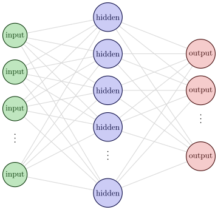
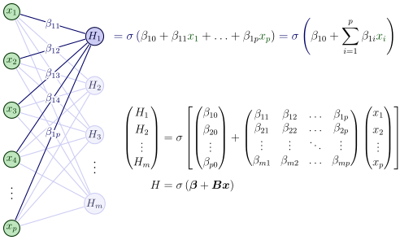
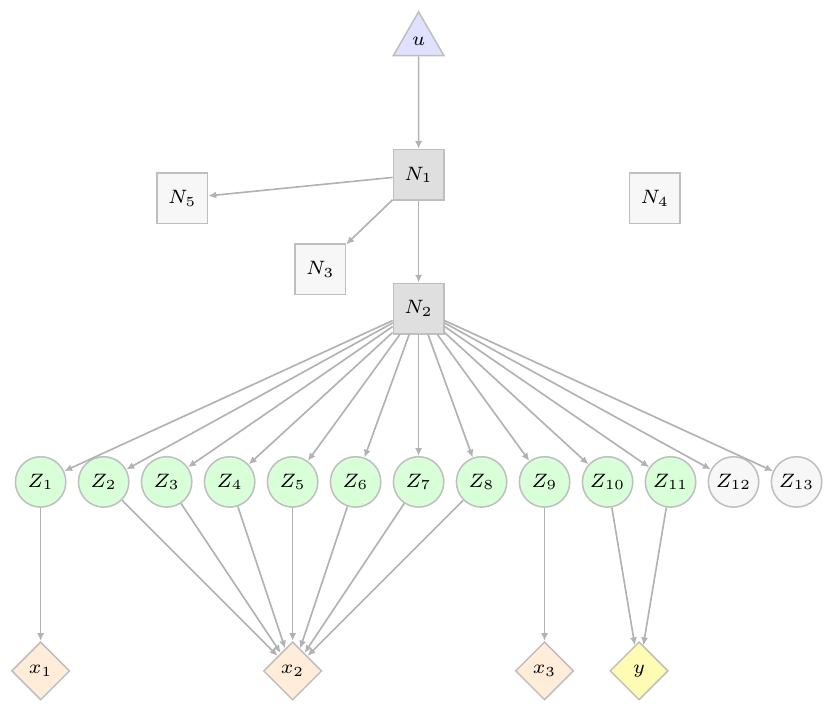

```{r}
#| label: startup
#| include: false

library(brulee)
library(tidymodels)
theme_set(theme_bw())

pkg <- function(x, cran = TRUE) {
  cl <- match.call()
  x <- as.character(cl$x)
  pkg_chr(x, cran = cran)
}

pkg_chr <- function(x, cran = TRUE) {
  if (cran) {
    res <- glue::glue('<span class="pkg"><a href="https://cran.r-project.org/package={x}">{x}</a></span>')
  } else {
    res <- glue::glue('<span class="pkg">{x}</span>')
  }
 res 
}

```

## Agenda

- Package installs
- Classical neural networks: multilayer perceptrons
- Modern neural networks architectures
- Foundational models

## Packages

We will use a few packages and will need devel versions of a few.

. . .

<br>

Let's install `r pkg(pak)`: 

```r
install.packages("pak")
```


. . .

then: 

```r
pak::pak(c("tidymodels", "brulee"))
pak::pak(c("tidymodels/parsnip", "tidymodels/tabby"))

```

then: 

```r
brulee::tab_icl_download_weights()
```


## Classical neural networks

The traditional structure of a neural network is the [multilayer perceptron](https://aml4td.org/chapters/cls-neural-nets.html#sec-cls-nnet) (MLP).

<br> 

:::: {.columns}

::: {.column width="50%"}

```{r}
#| label: mlp-struc
#| echo: false
#| fig-align: center
#| out-width: "70%"


```
:::

::: {.column width="50%"}
One or more _hidden layers_. 

<br>

These are feed-forward models, meaning each layer connects only to the next layer.
:::

::::


## Multilayer perceptrons

<br> 

:::: {.columns}

::: {.column width="70%"}

```{r}
#| label: mlp-start
#| echo: false
#| fig-align: center
#| out-width: "100%"


```
:::

::: {.column width="30%"}
Connections often use nonlinear [_activation functions_](https://aml4td.org/chapters/cls-neural-nets.html#sec-nnet-activation) for $\sigma(\cdot)$.
:::

::::

## Activation Functions


<br>

There are many nonlinear functions. Historically, a logistic/sigmoid was popular, but Restricted Linear Units (ReLU) and its variants are mostly used. 

<br>

```{r}
#| label: act
#| echo: false
#| fig-align: center
#| fig-width: 8
#| fig-height: 2
#| out-width: "100%"

lp_grid <- seq(-3, 3, length.out = 100)

act_functions <-
  bind_rows(
    tibble(
      input = lp_grid,
      output = binomial()$linkinv(lp_grid),
      activation = "logistic"
    ),
    tibble(input = lp_grid, output = tanh(lp_grid), activation = "tanh"),
    tibble(
      input = lp_grid,
      output = as.numeric(torch::nnf_relu(lp_grid)),
      activation = "relu"
    ),
    tibble(
      input = lp_grid,
      output = as.numeric(torch::nnf_elu(lp_grid)),
      activation = "elu"
    ),
    tibble(
      input = lp_grid,
      output = as.numeric(torch::nnf_gelu(lp_grid)),
      activation = "gelu"
    )
  )

act_functions |>
  ggplot(aes(input, output)) +
  geom_line() +
  facet_wrap(~activation, scale = "free_y", nrow = 1) +
  theme_bw()
```

## Multilayer perceptrons

- High maintenance
  - Lots of [preprocessing](https://aml4td.org/chapters/cls-neural-nets.html#sec-nnet-preprocessing).
  - Severely sensitive to [non-informative predictors](https://aml4td.org/chapters/feature-selection.html#fig-irrelevant-predictors).
  - Training large networks can be expensive.
  - Requires extensive tuning
  - Sensitive to initial (random) parameters
  - Need GPU for complex models
- Accurate but probably not well-calibrated. Perfectly capable of overfitting
- Can be highly performant but often not optimal (compared to boosting)

## Simple example

```{r}
#| label: data-splitting
library(tidymodels)
load("cls_data.RData")

set.seed(987)
cls_split <- initial_split(cls_data)
cls_split

cls_tr <- training(cls_split)
cls_te <- testing(cls_split)
```

## Simple example

:::: {.columns}

::: {.column width="55%"}
<br> 

```{r}
#| label: 2d-scat-code
#| eval: false
p <-
  cls_tr |>
  ggplot(aes(A, B)) +
  geom_point(
    aes(col = class), 
    cex = 2, alpha = 3 / 4
  ) +
  coord_fixed() +
  scale_color_brewer(palette = "Set1") +
  theme(legend.position = "top")
p
```

:::

::: {.column width="45%"}
```{r}
#| label: 2d-scat
#| echo: false
#| fig-align: center
#| fig-width: 5
#| fig-height: 5
#| out-width: "100%"
p <-
  cls_tr |>
  ggplot(aes(A, B)) +
  geom_point(
    aes(col = class), 
    cex = 2, alpha = 2 / 3
  ) +
  coord_fixed() +
  scale_color_brewer(palette = "Set1") +
  theme(legend.position = "top")
p
```

:::

::::

## Initial fit

```{r}
#| label: init-mlp
library(brulee)
set.seed(7826)
init_mlp <- brulee_mlp(
  class ~ A + B,          # Can also use a recipe or x/y format for data
  data = cls_tr,
  hidden_units = 6,
  learn_rate = 0.1,
  epochs = 100,
  stop_iter = 5,          # Default: randomly take 10% as internal validation
  batch_size = 32,
  method = "SGD"
)
```

## Did the model converge? 

:::: {.columns}

::: {.column width="40%"}

```{r}
#| label: mlp-loss
#| fig-align: center
#| fig-width: 5
#| fig-height: 5
#| out-width: "100%"

autoplot(init_mlp)
```

:::

::: {.column width="60%"}
```{r}
#| label: mlp-details
summary(init_mlp)
```
:::

::::

## Prediction

```{r}
#| label: init-pred

# prediction: 
grid_mlp <- augment(init_mlp, new_data = cls_grid) 

grid_mlp |> slice_head(n = 5)
```

## Training set fit

:::: {.columns}

::: {.column width="50%"}
<br>

```{r}
#| label: mlp-plot-code
#| eval: false
p + 
  geom_contour(
    data = grid_mlp,
    aes(z = .pred_red),
    breaks = 1 / 2,
    col = "black",
    linewidth = 1
  )
```

:::

::: {.column width="50%"}
```{r}
#| label: mlp-plot
#| echo: false
#| fig-align: center
#| fig-width: 5
#| fig-height: 5
#| out-width: "100%"
p + 
  geom_contour(
    data = grid_mlp,
    aes(z = .pred_red),
    breaks = 1 / 2,
    col = "black",
    linewidth = 1
  )
```
:::

::::

## Tuning with tidymodels

```{r}
#| label: ml-tune
#| eval: false
set.seed(826)
cls_rs <- vfold_cv(cls_tr)

mlp_spec <- 
  mlp(mode = "classification", hidden_units = tune(), epochs = 100) |> 
  set_engine("brulee")

mirai::daemons(10)
set.seed(658)
mlp_res <- 
  mlp_spec |> 
  tune_grid(
    class ~ A + B,
    resamples = cls_rs,
    grid = 25
  )
```

# Modern archeticures {background-color="#D04E59FF"}

## Modern architectures

There are a variety of tools that have trickled from image-based neural networks to tabular data models: 

- Residual connections
- In-network normalizations
- _Attention_

. . .

<br>

Deeper and more complex models can do well with a large amount of training data.

This requires more intensive computations (and a GPU)

## Helping gradient descent


:::: {.columns}

::: {.column width="40%"}
<br>

Residual connections and normalization are often used together.

They help solve vanishing or exploding gradients.
:::

::: {.column width="60%"}

$$
\overbrace{
\begin{aligned}
\boldsymbol{H}_1 &= f_1(\boldsymbol{x}) \notag \\
\boldsymbol{H}_2 &= f_2(\boldsymbol{H}_1) \notag \\
\boldsymbol{H}_3 &= f_3(\boldsymbol{H}_2) \notag \\
\boldsymbol{Y} &= f_4(\boldsymbol{H}_3) \notag
\end{aligned}
}^{\text{Standard MLP}}
\qquad
\overbrace{
\begin{alignedat}{3}
\boldsymbol{H}_1 &{}={} & f_1(\boldsymbol{x}) &{}+{} &\boldsymbol{x} \notag \\
\boldsymbol{H}_2 &{}={} & f_2(\boldsymbol{H}_1) &{}+{} &\boldsymbol{H}_1 \notag \\
\boldsymbol{H}_3 &{}={} & f_3(\boldsymbol{H}_2) &{}+{} &\boldsymbol{H}_2 \notag \\
\boldsymbol{Y} &{}={} & f_4(\boldsymbol{H}_3) \notag
\end{alignedat}}^{\text{Residual Connections}}
$$ 
:::

::::

## About GPUs

As model and/or data sizes increase, you need a GPU for computation. 

There are two main GPU computational frameworks: 

- [CUDA](https://en.wikipedia.org/wiki/CUDA): from NVidia GPUs
- [MPS](https://en.wikipedia.org/wiki/Metal_(API)): Apple CPUs

_Most_ of the focus is on CUDA instructions, but MPS works very well (outside of a few bugs). 

We mostly use (R) torch, and it enables a `device` argument with values `"cpu"`, `"cuda"`, or `"mps"`. There are a few exceptions. 

## About GPUs

Computations may be difficult to replicate when using the GPU. `torch::torch_manual_seed()` can help control things. 

<br> 

You _can_ run explicit (i.e., multiprocess) parallel processing with a GPU, but it is very important to ensure that there is enough GPU memory to send simultaneous jobs at once. 

<br> 

Unlike CPUs, GPUs are not as fault-tolerant when resources are overwhelmed. 

<br> 

For small-to-medium data sets, it might be faster to use the CPU ¯\\_(ツ)_/¯

## ResNet Fit

```{r}
#| label: resnet-fit
#| cache: true
set.seed(7826)
resnet_fit <- brulee_resnet(
  class ~ A + B,             
  data = cls_tr,
  hidden_units = c(6, 2, 6), # multiple layers
  residual_at = 1:2,         # residual after these layers
  learn_rate = 0.01,
  epochs = 100,
  stop_iter = 5,  
  batch_size = 32,
  method = "SGD",
  device = "cpu"             # default; results are different w/gpu, see below
)
```

<br> 

The `r pkg(tabby, cran = FALSE)` package enables tuning via `tabular_resnet()`

## ResNet Fit


:::: {.columns}

::: {.column width="50%"}

```{r}
#| label: resnet-loss
#| fig-align: center
#| fig-width: 5
#| fig-height: 5
#| out-width: "100%"

autoplot(resnet_fit)
```

:::

::: {.column width="50%"}
```{r}
#| label: resnet-plot
#| echo: false
#| fig-align: center
#| fig-width: 5
#| fig-height: 5
#| out-width: "100%"
grid_resnet <- 
  augment(resnet_fit, new_data = cls_grid) |> 
  select(A, B, .pred_class, .pred_red)

p + 
  geom_contour(
    data = grid_resnet,
    aes(z = .pred_red),
    breaks = 1 / 2,
    col = "black",
    linewidth = 1
  )
```
:::

::::

## CPU versus GPU (3 runs each)

:::: {.columns}

::: {.column width="80%"}
```{r}
#| label: devices
#| echo: false
#| fig-align: center
#| fig-width: 7
#| fig-height: 5
#| out-width: "80%"
load("losses.RData")

means <- 
  losses |> 
  slice_head(n = 1, by = c(iter)) |> 
  summarize(mean = mean(time_per_epoch), .by = c(Device)) |> 
  arrange(Device)

losses |> 
  mutate(
    iter = format(iter),
    Device = ifelse(Device == "MPS", "GPU", Device)
  ) |> 
  ggplot(aes(Epoch, Loss, col = Device, pch = Device, group = iter)) + 
  geom_line(alpha = 1 / 2) + 
  geom_point() +
  theme(legend.position = "top")
```
:::

::: {.column width="20%"}
<br> 


Time per epoch _for this data set_: 

- `r signif(means$mean[1], 2)` for CPU 
- `r signif(means$mean[2], 2)` for GPU

<br> 

I set the R and torch seeds each iteration. 
:::

::::

## Global and local models in drug discovery

For many nonclinical assays, _in silico_ models are usually built for medicinal chemists to use for prediction. 

<br>

For assays applicable everywhere (e.g., ADME, toxicology, etc.), _global models_ across all programs and therapeutic areas are used. 

<br>

However, for some new projects with HTS hits, _local_ computational chemistry models are created from very small data sets of _highly relevant_ compounds. 

<br> 

These small models are believed to be better since they have the *correct context* for their program. 

## Attention

This method improves specific predictions made with very large neural networks trained on extremely disparate training set points. 

<br>

Attention helps focus internal embeddings, biasing the network toward the relevant parts. For example, attention can address the question: 

> "Which other rows are most similar to me, and how should they influence my representation?"

"Local" becomes specific to the data that you are predicting. 


## Attention Types

For tabular data, we can compute column- and/or row-attention. 

During training: 

- Column attention takes the data in the current batch, and computes new embeddings _per feature_ and _across data points_. 
- Row attention adjusts the embeddings _for each row_ and _across embedding columns_. 

At prediction time, it estimates no new parameters. The predictions are influenced by the other rows being predicted. 

## SAINT

SAINT is a deep learning model that alternates between column and row attention. 

- The size of an attention _head_ is how many simultaneous attention computations are being computed ("width")
- An attention _block_ is a set of sequential heads that are executed ("depth"). 

## SAINT Fit

```{r}
#| label: saint-fit
#| cache: true
set.seed(7826)
saint_fit <- 
  brulee_saint(
    class ~ A + B,
    data = cls_tr, 
    num_embedding = 20,    # Ok, I admit that I used the tabby and tune packages
    hidden_units = 20,     # to find this combination of parameters. It took a
    num_attn_heads = 8,    # long time to run. 
    num_attn_blocks = 4,
    learn_rate = 0.005,    # learn_rate and dropout for hidden units were 
    dropout_hidden = 0,    # unusually low for these data. 
    epochs = 100,
    stop_iter = 10,  
    batch_size = 16,
    method = "SGD",
    device = "mps"
  )
```

<br> 

The `r pkg(tabby, cran = FALSE)` package enables tuning via `tabular_saint()`

## SAINT Fit


:::: {.columns}

::: {.column width="50%"}

```{r}
#| label: saint-loss
#| fig-align: center
#| fig-width: 5
#| fig-height: 5
#| out-width: "100%"

autoplot(saint_fit)
```

:::

::: {.column width="50%"}
```{r}
#| label: saint-plot
#| echo: false
#| fig-align: center
#| fig-width: 5
#| fig-height: 5
#| out-width: "100%"
#| cache: true
grid_saint <- 
  augment(saint_fit, new_data = cls_grid) |> 
  select(A, B, .pred_class, .pred_red)

p + 
  geom_contour(
    data = grid_saint,
    aes(z = .pred_red),
    breaks = 1 / 2,
    col = "black",
    linewidth = 1
  )
```
:::

::::

# Foundational Models {background-color="#70B7E1FF"}

## Foundational models

Normally we fit a neural network to a training set. Then we can use it to make predictions. 

<br> 

Foundational neural networks are very large _pretrained_ models (about 10<sup>8</sup> parameters) that we can use for prediction. 

<br>

How are they trained? 

## Simulated random data

The networks treat the entire dataset as a training set point and use millions of training points.

<br>

Where do the training data come from? 

<br>

They are simulated with a Structural Causal Models (SCMs). 

<br> 

Random data sizes/types, latent variables, nonlinear transforms, and other quantities are drawn from _prior distributions_. 

#
:::: {.columns}

::: {.column width="50%"}
An example SCM.

- A random graph with 5 nodes and connections. 

- Each node adds a layer of complexity, nonlinear relationships, transformations, etc. 

- Latent variables ($Z_j$) comprise a multivaraite distribution and these create our _obsedrved columns_. 

This process is done XX,000,000 times during training. 
:::

::: {.column width="50%"}
```{r}
#| label: scm
#| echo: false
#| fig-align: "center"

```
:::

::::


## Predictions

We still need a "training set" to trigger _in-context learning_ (ICL). This happens via _many_ iterations of attention. 

<br>

This lets the foundational model focus on the parts of the vast network most appropriate for our data. 

<br>

The training set and prediction samples are passed in at the same time, but predictions are reported for the latter. 

<br>

These models perform remarkably well. 

## Models

There are different tabular foundational models. The two leading models are TabPFN and TabICL. Their results are very similar. 

More are popping up all the time. 

- The `r pkg(tabpfn)` package serves that model via `r pkg(reticulate)`
- `r pkg(brulee)` has an R torch implementation `brulee_tab_icl()`

Original implementations are in Python. 

We'll focus here on TabICL since TabPFN requires a license key. 

## TabICL "fit"

:::: {.columns}

::: {.column width="50%"}

<br>

```{r}
#| label: tabicl
#| results: hide

icl_fit <- 
  brulee_tab_icl(
    class ~ A + B, 
    data = cls_tr
  ) # That's it!
```

:::

::: {.column width="50%"}
```{r}
#| label: tabicl-plot
#| echo: false
#| fig-align: center
#| fig-width: 5
#| fig-height: 5
#| out-width: "100%"
#| cache: true
grid_tabicl <- 
  augment(icl_fit, new_data = cls_grid) |> 
  select(A, B, .pred_class, .pred_red)

p + 
  geom_contour(
    data = grid_tabicl,
    aes(z = .pred_red),
    breaks = 1 / 2,
    col = "black",
    linewidth = 1
  )
```
:::

::::

## How much data before ICL kicks in? 

```{r}
#| label: icl
#| echo: false
#| fig-align: center
#| fig-width: 7
#| fig-height: 3.5
#| out-width: "40%"
load("icl_uptake.RData")

icl_uptake |>
  ggplot(aes(size, .estimate)) +
  geom_point(alpha = 1 / 4, pch = 1) +
  facet_wrap(~ Metric, scales = "free_y") +
  geom_smooth(span = 0.2, se = FALSE, col = "red") +
  theme_bw() +
  labs(x = "Training Set Size", y = "Out-of-Sample Performance")
```


## Notes on foundational models

- They appear to be highly resistant to non-informative predictors. 
- Regression models can also make quantile predictions. 
- The default models use ensembles of 8 different estimators
  - The model noise is low, and the ensemble does not buy much. 
- TabPFN has a very rapid development cycle. Improvements come out every few months. 
- There are foundational models specific to time series forecasting.
  - TabICL has one and Amazon created chronos2 (also avalable in `r pkg(brulee)`)

## TabICL test results

```{r}
#| label: tabicl-test
#| cache: false
cls_mtr <- metric_set(brier_class, roc_auc, mn_log_loss)

icl_test_pred <- augment(icl_fit, cls_te)

icl_test_pred |> cls_mtr(class, .pred_red)
```

## TabICL test results

```{r}
#| label: tabicl-test-plot
#| echo: false
#| fig-align: center
#| fig-width: 5
#| fig-height: 5
#| out-width: "50%"
#| cache: true
cls_te |>
  ggplot(aes(A, B)) +
  geom_point(
    aes(col = class), 
    cex = 2, alpha = 3 / 4
  ) +
  coord_fixed() +
  scale_color_brewer(palette = "Set1") +
  theme(legend.position = "top") + 
  geom_contour(
    data = grid_tabicl,
    aes(z = .pred_red),
    breaks = 1 / 2,
    col = "black",
    linewidth = 1
  )
```
## References

**General**

- Vaswani, A, N Shazeer, N Parmar, J Uszkoreit, L Jones, A Gomez, Ł Kaiser, and I Polosukhin. 2017. "[Attention Is All You Need](https://proceedings.neurips.cc/paper_files/paper/2017/hash/3f5ee243547dee91fbd053c1c4a845aa-Abstract.html)." Advances in Neural Information Processing Systems 30.

- Gorishniy, Y, I Rubachev, V Khrulkov, and A Babenko. 2021. "[Revisiting Deep Learning Models for Tabular Data](https://scholar.google.com/scholar?hl=en&as_sdt=0%2C7&q=Revisiting+deep+learning+models+for+tabular+data&as_ylo=2021&as_yhi=2021&btnG=)." Advances in Neural Information Processing Systems 34: 18932–43.

- Shwartz-Ziv, R, and A Armon. 2022. "[Tabular Data: Deep Learning Is Not All You Need](https://scholar.google.com/scholar?hl=en&as_sdt=0%2C7&q=Tabular+data+Deep+learning+is+not+all+you+need&as_ylo=2022&as_yhi=2022&btnG=)." Information Fusion 81: 84–90.


## References

**ResNet**

- He, K, X Zhang, S Ren, and J Sun. 2016. "[Deep Residual Learning for Image Recognition](https://scholar.google.com/scholar?hl=en&as_sdt=0%2C7&q=Deep+residual+learning+for+image+recognition&as_ylo=2016&as_yhi=2016&btnG=)." In Proceedings of the IEEE Conference on Computer Vision and Pattern Recognition, 770–78.

- Gorishniy, Y, I Rubachev, V Khrulkov, and A Babenko. 2021. "[Revisiting Deep Learning Models for Tabular Data](https://scholar.google.com/scholar?hl=en&as_sdt=0%2C7&q=Revisiting+deep+learning+models+for+tabular+data&as_ylo=2021&as_yhi=2021&btnG=)." Advances in Neural Information Processing Systems 34: 18932–43.  (see Eq 2)

**SAINT**: 

- Somepalli, G, M Goldblum, A Schwarzschild, B Bruss, and T Goldstein. 2021. "[Saint: Improved Neural Networks for Tabular Data via Row Attention and Contrastive Pre-Training](https://scholar.google.com/scholar?hl=en&as_sdt=0%2C7&q=+Saint+Improved+neural+networks+for+tabular+data+via+row+attention+and+contrastive+pre+training&as_ylo=2021&as_yhi=2021&btnG=)." arXiv Preprint arXiv:2106.01342.

## References

**TabICL**: 

- Qu, J, D Holzmuller, G Varoquaux, and M Morvan. 2025. "[TabICL: A Tabular Foundation Model for in-Context Learning on Large Data](https://scholar.google.com/scholar?hl=en&as_sdt=0%2C7&q=+TabICL+A+tabular+foundation+model+for+in+context+learning+on+large+data&as_ylo=2025&as_yhi=2025&btnG=)." arXiv Preprint arXiv:2502.05564.

- Qu, J, D Holzmuller, G Varoquaux, and M Morvan. 2026. "[TabICLv2: A Better, Faster, Scalable, and Open Tabular Foundation Model](https://scholar.google.com/scholar?hl=en&as_sdt=0%2C7&q=+TabICLv2+A+better+faster+scalable+and+open+tabular+foundation+model&as_ylo=2026&as_yhi=2026&btnG=)." arXiv Preprint arXiv:2602.11139.

## References

**TabPFN**: 

- Müller, S, N Hollmann, S Arango, J Grabocka, and F Hutter. 2021. "[Transformers Can Do Bayesian Inference](https://scholar.google.com/scholar?hl=en&as_sdt=0%2C7&q=Transformers+can+do+bayesian+inference&as_ylo=2021&as_yhi=2021&btnG=)." arXiv Preprint arXiv:2112.10510.

- Hollmann, N, S Müller, K Eggensperger, and F Hutter. 2022. "[TabPFN: A Transformer That Solves Small Tabular Classification Problems in a Second](https://scholar.google.com/scholar?hl=en&as_sdt=0%2C7&q=+TabPFN+A+transformer+that+solves+small+tabular+classification+problems+in+a+second&as_ylo=2022&as_yhi=2022&btnG=)." arXiv Preprint arXiv:2207.01848.

- Hollmann, N, S Müller, L Purucker, A Krishnakumar, M Körfer, S Hoo, R Schirrmeister, and F Hutter. 2025. "[Accurate Predictions on Small Data with a Tabular Foundation Model](https://scholar.google.com/scholar?hl=en&as_sdt=0%2C7&q=Accurate+predictions+on+small+data+with+a+tabular+foundation+model&as_ylo=2025&as_yhi=2025&btnG=)." Nature 637 (8045): 319–26.

- Grinsztajn, L, K Flöge, O Key, F Birkel, P Jund, B Roof, M Manium, et al. 2026. "[TabPFN-3: Technical Report](https://scholar.google.com/scholar?hl=en&as_sdt=0%2C7&q=+TabPFN+3+Technical+Report&as_ylo=2026&as_yhi=2026&btnG=)." arXiv Preprint arXiv:2605.13986.


# Thanks for listening! {background-color="#FAE093FF"}
